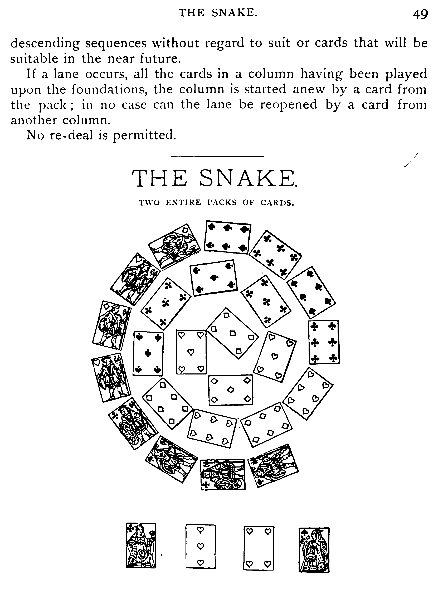

*[Return to Scanning](./scanning.md)*

# Image processing (Scantailor)

[Scantailor](http://scantailor.org/) describes itself as an:

 > interactive post-processing tool for scanned pages. It performs operations such as page splitting, deskewing, adding/removing borders, and others. You give it raw scans, and you get pages ready to be printed or assembled into a PDF or DJVU file. 

Scantailor's goal is to clean and optimize your page images for OCR and for inclusion in a multi-page pdf or djvu book. Scantailor has automated and semi-automated capabilities to crop your page images, select just the portions of the page with content on them, rotate, deskew, dewarp, and otherwise cleanup common page troubles. Scantailor lets you select just the information from your page scans that you want to keep and trow away the rest. Most of these capabilities work best on pages with only text on them but Scantailor also lets you draw boxes around pictures in your book to preserve all the scan detail in those areas.

The [Scantailor documentation](https://github.com/scantailor/scantailor/wiki) does a good job of explaining the project, including a [Video Tutorial](http://vimeo.com/12524529). The 30 second summary is that you load page images into Scantailor, use each of the different processing tools one by one in order, and then output cleaned and much smaller tiff images for each page. Multiple tools exist to take these Scantailor-processed images, automatically run them through OCR to generate text, and then bind up that text layer and the image files into a single pdf or djvu file with searchable and selectable text.

Two techniques account for just how much smaller and cleaner Scantailor gets your page images: content selecting and bitonal conversion. It is important to understand what is going on with these techniques in order to avoid surprises down the line.

### Content selection

Content selection is the simplest way to reduce the size of your page images. Images taken with a camera will generally include significant areas around the book that are unnecessary in your final page image. Scantailor will try and automatically select and remove most of this during the `Split Page` step early on. After selecting the page borders Scantailor goes even further in the `Select Content` step and attempts to automatically select only the portions of each page that contain text and images.

The basic idea is that everything else on a page can be discarded and replaced with pure white later on because any non-text or images of the page will only confuse OCR and take up more space in the final file than pure white pixels will. Effectively Scantailor is taking these content areas and then putting them on new blank pages for you. You select the size of those new pages and the position of the content boxes on those new pages in the next step `Margins`.

### Bitonal conversion

After you have run through the `Content Selection` and `Margins` steps on all your pages, the `Output` stage offers the second large cleanup/compression step, and it is a big one. For each page image you are allowed to choose a "Mode" on the left hand side of the screen. If you have ever done some image editing, you can understand these modes as roughly equivalent to colorspaces.

The default mode, "Black and White" takes all the pixels in your image and converts them either to pure white or pure black. This is equivalent to the image processing step known as "thresholding". The result is that text borders are made very sharp, uneven lightning effects are generally removed, and the file size is hugely decreased. Images made of only pure white and black, called bitonal images, can be represented using much less information than ones with complex colors and shades but many kinds of detail can be effected.

As an example of the power of this type of image processing, look at these before and after images of a camera-captured book page from a very yellowed book:

This step is where the biggest tradeoffs are going to come for your images. If images are too poorly lit or there are too many marks on a page, you may lose definition on some of the page writing. Generally, the better your scans, the less you will lose during this stage. If things get particularly bad, you may need to re-scan some of your pages or you may need to switch to a different page mode and make due with larger file size results.  

`Color / Grayscale` mode will preserve all of the details in your original page images. While this means that you can preserve every detail, it also means that you will preserve every defect. All that extra information will make your final files larger and much less clear. Ideally you would only do this for individual pages with illustrations or other fine detail.

`Mixed` mode allows you to get the best of both worlds. You can mark certain portions of the page as picture areas. Scantailor will apply the `Color / Greyscale` mode to just those areas and the `Black and White` mode to rest of the page. If you have a book with pictures in it, this is the mode to use.

**Important**: Always keep your scantailor project file! I encourage you to save all of your intermediate files too, like the scantailor output files, but if you save nothing else, your raw page scans and your scantailor file are enough to regenerate everything else so save them and back them up.

Once you have finished processing all your scan images with scantailor you are ready to author your scantailor output into a single pdf or djvu file. 

*Continue to [Book Authoring](./book-authoring.md)*
